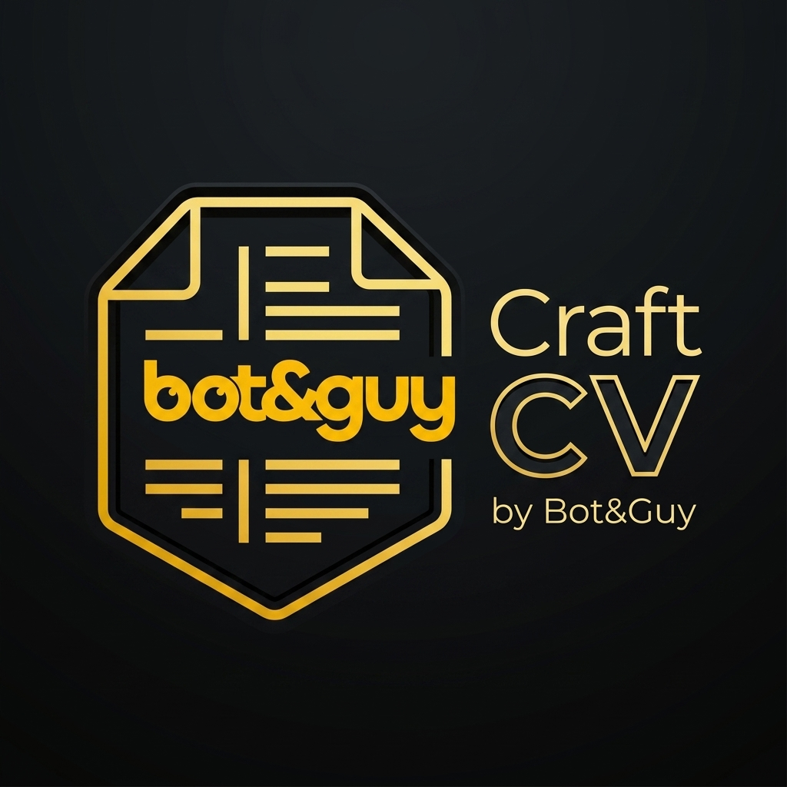

# CraftCV by Bot&Guy

**CraftCV** is an AI-powered, ATS-optimized, multi-template Resume Builder product developed by Bot&Guy. Built with Next.js 16/15, React 19, Tailwind CSS, Supabase, Framer Motion, and PDF export tools.



---

## Key Features

- **Product Landing Page (`/`)**: High-converting showcase page with live interactive resume badge, template gallery, pricing tier, and FAQs.
- **Authentication**: Built-in authentication powered by Supabase Auth (`/auth/login` and `/auth/register`).
- **Resumes Dashboard (`/dashboard`)**: Manage, duplicate, rename, search, and delete your resumes.
- **Multi-Template Builder (`/dashboard/resume/[id]`)**:
  - Live side-by-side editing interface with real-time multi-page break calculations.
  - Custom section ordering, drag-and-drop hierarchy, photo upload, and custom colors & fonts.
  - Supports A4, US Letter, and Legal paper sizes with margin and font size controls.
  - High-resolution vector PDF export using `html2canvas` & `jspdf`.
- **Standalone Database Schema**: Independent Supabase database migration scripts in `supabase/migrations/`.

---

## Getting Started

### 1. Prerequisites
- Node.js 18+ (or Node 20+)
- npm or pnpm or yarn
- Supabase project (Free tier or self-hosted Postgres)

### 2. Installation

Install the dependencies:

```bash
npm install
```

### 3. Database Setup

Run the SQL migration script located at `supabase/migrations/20260725000000_init_craftcv_db.sql` in your Supabase SQL Editor:

1. Open your Supabase Dashboard -> **SQL Editor**.
2. Paste the contents of `supabase/migrations/20260725000000_init_craftcv_db.sql`.
3. Click **Run** to set up the `profiles` & `resumes` tables, RLS policies, and triggers.

### 4. Environment Configuration

Copy `.env.example` to `.env` and fill in your Supabase credentials:

```env
NEXT_PUBLIC_SUPABASE_URL=https://your-supabase-project.supabase.co
NEXT_PUBLIC_SUPABASE_ANON_KEY=your-supabase-anon-key
```

### 5. Running Locally

Start the Next.js development server:

```bash
npm run dev
```

Open [http://localhost:3000](http://localhost:3000) (or `http://localhost:3001`) in your browser.

---

## Project Structure

```
craftcv-bot-guy/
├── public/                        # Logo & static assets
├── supabase/
│   └── migrations/
│       └── 20260725000000_init_craftcv_db.sql # Standalone database SQL schema
├── src/
│   ├── app/
│   │   ├── auth/                 # Sign in, sign up & callback routes
│   │   ├── dashboard/            # Resume management grid & builder ([id])
│   │   ├── globals.css           # Custom theme tokens & glassmorphism
│   │   ├── layout.tsx            # Root layout with Auth initializer
│   │   └── page.tsx              # CraftCV Product Landing Page
│   ├── components/               # Navbar, Footer, UI components
│   ├── lib/                      # Supabase clients & utility helpers
│   ├── store/                    # Zustand auth store
│   └── types/                    # Database TypeScript definitions
├── package.json
└── README.md
```

---

## License & Credits

Designed & Crafted with ❤️ by **Bot&Guy Team**.
"# CraftCV-bot-guy" 
